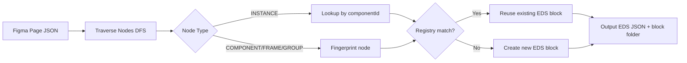

# AEM EDS — Full End-to-End Workflow (Single Prompt)

> **This is the only prompt you need.** It covers every step from Figma analysis through
> frontend block implementation, AEM content authoring, GA4 event tracking, and Docusaurus documentation.
> Every phase has a mandatory STOP gate. The agent MUST NOT skip any gate.

---

## Project Variables

All configurable values are stored in `.github/instructions/project-variables.csv`.
The CSV contains `Variable,Value` pairs. Update the CSV to configure the project —
every `${VARIABLE_NAME}` reference in this file resolves from that CSV.

## How to use this prompt

Update the variables in `project-variables.csv`, then paste this file as your prompt:

```
Figma URL          : ${FIGMA_URL}
Desktop image URL  : ${DESKTOP_IMAGE_URL}
Mobile image URL   : ${MOBILE_IMAGE_URL}
AEM Author URL     : ${AEM_AUTHOR_URL}
AEM Site root      : ${AEM_SITE_ROOT}
AEM DAM root       : ${AEM_DAM_ROOT}
AEM Page template  : ${AEM_PAGE_TEMPLATE}
Target page path   : ${TARGET_PAGE_PATH}
Target page title  : ${TARGET_PAGE_TITLE}
```

---

## Working Directory Rules (MANDATORY)

| Phase | Working Directory | Why |
|---|---|---|
| 0 — Analysis | `Experiment/` (EDS root) | `ls blocks/`, fetch_webpage, block reads |
| 1 — Implementation | `Experiment/` (EDS root) | All block files (JS/CSS/JSON) live here |
| 2 — Build & Lint | `Experiment/` (EDS root) | npm, eslint, stylelint are installed here |
| 3 — AEM Authoring | `Migration/` root | Needs access to BOTH `migration-deptagency/` AND `Experiment/`; running from inside `Experiment/` breaks Maven paths and relative references in `authoring-migration.instructions.md` |
| 4 — GA4 Analytics | `Experiment/` (EDS root) | `scripts/` lives here |
| 5 — Docusaurus | `Experiment/` (EDS root) | `docusaurus/` is a subdirectory of EDS root |

> **Automation reference:** `d:/Migration/fullworkflow_runner.py` implements all phases
> with automatic cwd switching — run it from any directory.

---

## Environment Reference

| Environment | Author URL | create-aem-page | Content API (get/put/patch) |
|---|---|---|---|
| Dev (${AEM_DEV_ENV_ID}) | `${AEM_DEV_AUTHOR_HOST}` | ✅ YES | ❌ NO (404) |
| Prod (${AEM_PROD_ENV_ID}) | `${AEM_PROD_AUTHOR_HOST}` | ✅ YES | ✅ YES |

> The MCP bearer token authenticates to Adobe MCP middleware (`mcp.adobeaemcloud.com`), NOT directly to AEM.
> If the Content API returns 404, stop and report — do NOT switch environments silently.

---

---

# ═══════════════════════════════════════════
# PHASE 0 — FIGMA ANALYSIS & COMPONENT INVENTORY
# ═══════════════════════════════════════════

## 0.1 — Figma fetch (MANDATORY FIRST STEP)

Use the Figma MCP to fetch the design:
- Load `get_design_context` with the provided Figma fileKey and nodeId.
- Load the desktop image URL and mobile image URL as additional visual references.
- Use BOTH Figma data and the visual images as the source of truth.
- Cross-check for discrepancies between Figma layers and the visual screenshots.

Also study the following block collection references before making any decisions:
- https://www.aem.live/developer/block-collection
- https://www.aem.live/developer/block-party/

### Traversal strategy (DFS over Figma nodes)

Traverse every node depth-first, branching on `node.type`:

| Node type | Action |
|---|---|
| `INSTANCE` | Look up by `componentId` — strong reuse signal; match against `/blocks/` registry |
| `COMPONENT` / `COMPONENT_SET` | Record as source; fingerprint like a frame |
| `FRAME` / `GROUP` | Compute structural fingerprint; look up registry; reuse if match found, else create new |

Skip invisible or utility nodes (check size / visibility metadata before processing).



## 0.2 — Component inventory analysis

For every distinct section or component visible in the design:

1. **Normalize the name** from the Figma layer name using these rules:
   - Lowercase, spaces → `-`, slashes → `-`, strip illegal chars, collapse multiple hyphens.
   - Examples: `"Primary Button"` → `button-primary`, `"Card / Product"` → `product-card`, `"Button / Large"` → `button--large` (BEM modifier on existing block).
2. **Check workspace** — does a folder already exist under `/blocks/<name>/`? If yes → REUSE or MODIFY, never recreate.
3. Classify it as one of:
   - **REUSE** — an existing AEM EDS block pattern (cards, columns, hero, accordion, etc.) can be used as-is
   - **MODIFY** — an existing block pattern with a variation/extension needed. If an existing block needs a **variation** (e.g. different layout, style modifier, or state) but does NOT require a new block, follow `.github/instructions/variant-management-guide.md` to implement the variation on the existing block. Do NOT create a new block in this case.
   - **NEW** — design cannot be expressed using any block collection pattern
4. For REUSE / MODIFY: name the exact block collection pattern it maps to.
5. For NEW: state concisely why no existing pattern fits.
6. Note the variation type if applicable.

### Fingerprint schema (reuse detection)

To identify repeated blocks, normalize and hash these fields (ignore exact text/image content):
- `type`, `layoutMode`, `childrenCount`, child-type histogram (text/image/shape counts)
- `padding`, `gap`, `borderRadius` (rounded to nearest int)
- Sorted unique `fontSizes`, `fontFamilies`, `fillColors`
- Auto-layout flag, interactive element count

Identical fingerprint = high reuse confidence. Use as hash map key for O(1) lookup.

### Similarity metrics

When fingerprints don't match exactly, apply:
- **Cosine** on numeric feature vectors — threshold ≥ 0.9 for strong match.
- **Jaccard** on categorical sets (style names, child types) — threshold ≥ 0.75 for reuse.
- **Levenshtein** on normalized node names — ≤ 2 edits suggests same concept.

Reuse if fingerprint matches **or** (cosine ≥ 0.9 **and** Jaccard ≥ 0.8). Score < 0.8 → treat as new component.

### Conflict resolution

Confidence score: `0.5×(fingerprint match) + 0.3×(cosine) + 0.2×(name similarity)`.  
Highest score wins when multiple entries match.  
Score < 0.8 or ambiguous → generate new component, flag for review.

### Variants & states

- **Figma COMPONENT_SET with `variantProperties`** → one EDS block; use CSS modifier class (e.g. `block--variant`) or a `select` field in the model. Do NOT create a separate block.
- **Hover / active / focus states** → CSS only; no authoring field needed.
- **Workspace variations** (existing block needing visual change) → follow `variant-management-guide.md`. Do NOT create a new block.

### Component registry

Maintain a mental (or persisted) map of `{ edsComponentName → { figmaComponentId, fingerprint, variants, instances[] } }`.  
- First-time component → create new EDS artifacts.
- Subsequent instances of the same `componentId` or fingerprint → reuse the existing entry.
- On re-runs: only reprocess changed or new nodes; leave unchanged entries untouched.

## 0.3 — ⛔ STOP GATE 0 — Component Inventory Confirmation

Present the full inventory as a table:

| # | Component Name | Status | Exists in `/blocks/`? | Block Collection Pattern | Variation / Notes |
|---|---|---|---|---|---|
| 1 | `component-name` | NEW / REUSE / MODIFY | ✅ Yes / ❌ No | pattern name or — | notes |
| … | … | … | … | … | … |

Then ask:

---
**Is this component inventory correct?**

- ✅ **Yes, proceed** — I will move to Phase 1 and implement each component one at a time.
- ❌ **No** — please describe what needs to change and I will update the table before proceeding.

---

> **HARD RULE: Do NOT write a single line of CSS, JS, or JSON until the user confirms this table.**
> If the user says No, update the table and ask again. Repeat until confirmed.

---

---

# ═══════════════════════════════════════════
# PHASE 1 — PER-COMPONENT IMPLEMENTATION (ONE AT A TIME)
# ═══════════════════════════════════════════

> For each component in the confirmed inventory, execute the full loop below before moving to the next.
> Do NOT batch multiple components. Do NOT implement component N+1 until component N is confirmed.

---

## 1.A — ⛔ STOP GATE 1 — Pre-implementation Confirmation (per component)

Before writing any code for a component, present the following structured summary:

**Component: `<component-name>` (Component N of M)**

1. **Type** — NEW block / MODIFY existing / REUSE existing (which one)
2. **Figma sections understood** — list every distinct section, element, state, and interactive behaviour you identified in the Figma for this component
3. **Desktop vs mobile differences** — explicitly describe how layout, spacing, or content changes between breakpoints
4. **Block collection pattern** — which pattern you will reuse, and exactly how; OR a clear justification for why a new block is required
5. **Design tokens** — list every token from `/styles/tokens.css` you plan to use (e.g. `--color-accent-primary`, `--space-md`). If a needed token is missing, name it here and state which nearest existing token you will substitute.
6. **Files to create or modify**:
   - `blocks/<name>/<name>.css` — yes/no
   - `blocks/<name>/<name>.js` — yes/no (justify if yes)
   - `blocks/<name>/_<name>.json` — yes/no (not needed if reusing an existing block)
   - `blocks/<name>/README.md` — always yes
   - `blocks/<name>/docs/ue-authoring.svg` — always yes (generated)
   - `models/_section.json` — yes/no (add block ID to filter)
7. **xwalk row mapping** — list the expected DOM rows before JS runs. For example:
   - Row 0 → `label` (1 col, text) — model field
   - Row 1 → `heading` (1 col, richtext) — model field
   - Row 2+ → child items (2 cols: image, text)
   - Clearly state which rows are model fields (1-col) vs child items (multi-col).
8. **Assumptions** — any decision you are making because the Figma is unclear or missing information

Then ask:

---
**Does this match your understanding of `<component-name>`?**

- ✅ **Yes** — proceed with implementation of this component
- ❌ **No** — describe what needs to change; I will update my understanding and ask again

---

> **HARD RULE: Do NOT write any code until the user confirms with Yes.**
> Do NOT proceed to 1.B until confirmed.

---

## 1.B — Implementation (only after 1.A confirmed)

### Architecture decision (check in this order)

1. Can this be expressed using an **existing block collection block** (cards, columns, hero, accordion, table, embed, carousel, etc.)? → REUSE. Do NOT create new files except README.
2. Can this be expressed by **composing two or more** existing blocks? → COMPOSE. Do NOT create a new block.
3. Only if neither 1 nor 2 is possible → create a NEW custom block.

### EDS block architecture rules

- Keep authored markup simple (standard table-based authoring).
- Keep the final DOM minimal and semantic — do NOT mirror Figma layers.
- Maximum 3 authored columns per row.
- Do NOT create a block item (child model) unless the design genuinely requires repeatable child rows.
- Block item rule: if you create a block item, the parent block MUST reference it in its filter. If there is no parent–child relationship in the design, use a single flat model.
- Do NOT create HTML files.

### xwalk / Universal Editor DOM rendering (CRITICAL)

> **This section is NON-NEGOTIABLE. Every JS `decorate()` function MUST follow these rules.**

When using the Universal Editor with xwalk, AEM renders block content differently
from traditional document-based (Boilerplate/Franklin) authoring:

#### How xwalk renders model fields into DOM rows

| Scenario | DOM structure |
|---|---|
| **Non-container block** with N model fields | N rows, each with **1 column** (one row per field) |
| **Container block** with N own model fields + M child items | N single-column rows (own fields) **then** M multi-column rows (child items, one column per item field) |
| **Container block** with 0 own model fields + M child items | M multi-column rows only (child item rows start at row 0) |
| **Fields with `col1_` / `col2_` prefix** | Grouped into columns within the same row (traditional multi-column layout) |

**Key difference from traditional EDS:** In traditional document-based EDS, a table row maps
directly to a block row, and table cells become columns within that row. Authors control the
structure. In xwalk, AEM **automatically** generates the row/column structure from the model
definition — each field without a column prefix becomes its **own row**.

#### Example: Container block with `label` + `heading` fields and child items

Model:
```json
{
  "id": "my-block",
  "fields": [
    { "name": "label", "component": "text" },
    { "name": "heading", "component": "richtext" }
  ]
}
```
Child item model:
```json
{
  "id": "my-block-item",
  "fields": [
    { "name": "image", "component": "reference" },
    { "name": "text", "component": "richtext" }
  ]
}
```

**xwalk-rendered DOM (before JS runs):**
```html
<div class="my-block">
  <!-- Container model fields: 1 column each -->
  <div><div><p>Label text</p></div></div>          <!-- row 0: label -->
  <div><div><div>Heading richtext</div></div></div> <!-- row 1: heading -->

  <!-- Child items: 2 columns each (image + text) -->
  <div>                                             <!-- row 2: item 1 -->
    <div><picture>…</picture></div>
    <div><div>Item 1 text</div></div>
  </div>
  <div>                                             <!-- row 3: item 2 -->
    <div><picture>…</picture></div>
    <div><div>Item 2 text</div></div>
  </div>
</div>
```

#### Correct JS pattern — partition rows by column count

```js
export default function decorate(block) {
  const rows = [...block.children];

  // Partition: 1-column rows = container model fields, 2+-column rows = child items
  const headerCols = [];  // inner column divs from model-field rows
  const itemRows = [];    // child-item rows (kept as-is)

  rows.forEach((row) => {
    const cols = [...row.children];
    if (cols.length >= 2) {
      itemRows.push(row);           // child item
    } else if (cols[0]) {
      headerCols.push(cols[0]);     // extract the single column div
      row.remove();                 // remove the now-empty row wrapper
    }
  });

  // headerCols[0] = first model field, headerCols[1] = second, etc.
  // itemRows = child items only, ready for processing
}
```

#### Common mistakes to AVOID

| ❌ Wrong | ✅ Correct |
|---|---|
| `const cols = [...rows[0].children]; cols[0] = label; cols[1] = heading;` — assumes both fields are columns in row 0 | Partition rows by column count; `headerCols[0]` = label from row 0, `headerCols[1]` = heading from row 1 |
| `rows.slice(1).forEach(…)` — assumes only row 0 is the header | Count the number of model fields; items start after that many rows |
| Treating a 1-column model-field row as a child item | Always check `cols.length >= 2` before treating a row as a child item |
| Hardcoding row indices (`rows[0]`, `rows[1]`, `rows[2]`) for fixed field positions | Use the column-count partition pattern — it's resilient to model changes |

#### Special cases

- **`imageAlt` fields**: A text field named `{fieldName}Alt` is automatically applied as the `alt`
  attribute on the corresponding image's `` tag. It does NOT create a separate row.
- **Non-container blocks** (no filter, no children): All fields are still separate rows.
  Process each row sequentially by index or use a similar partition approach.
- **Empty/optional fields**: xwalk always renders a row for every model field, even if the
  field value is empty. The row will contain an empty `<div>`. Handle gracefully.

### JSON files (MANDATORY for NEW / MODIFY blocks)

File: `blocks/<block-name>/_<block-name>.json`

Required top-level keys: `definitions`, `models`, `filters`

Rules:
- Use kebab-case for all IDs and names.
- Include ONLY fields that are visibly present in the Figma. No speculative fields.
- Do NOT exceed the required number of columns.
- Multi-column field naming: `col1_img`, `col1_heading`, `col1_text`, `col1_cta` / `col2_…` / `col3_…`
- Do NOT touch `component-models.json`, `component-filters.json`, or `component-definition.json` — ever.
- Add the new block ID to `models/_section.json` → `filters[0].components[]`. This is the ONLY shared file you may modify.
- If reusing an existing block → no JSON needed; skip this step.

Cross-check your JSON against Block Collection examples before finalising:
- Does the naming match real EDS conventions?
- Is the model minimal (no over-engineering)?
- Are you using an existing pattern where one exists?

### Figma attribute → EDS model field mapping

| Figma attribute | EDS model field type |
|---|---|
| `characters` (text node) | `text` |
| `fills.imageRef` (image fill) | `reference` (DAM path) |
| `componentId` INSTANCE linking to a page | `aem-content` |
| Boolean variant property | `select` with true/false options |
| Enum variant property | `select` with the variant values as options |

### Design token rules (STRICT)

- ALL visual values MUST come from `var(--token-name)` referencing `/styles/tokens.css`.
- Do NOT define tokens inside block CSS, inline styles, or JS.
- Do NOT write `:root { --anything: value; }` anywhere except `tokens.css`.
- Do NOT use magic numbers (raw px, hex, rem values that are not tokens).
- If a token is missing → use the nearest semantic token. Document the substitution. Do NOT define a new token inline.

### CSS rules

- Mobile-first CSS only.
- Block-scoped selectors only — no global styles, no `:root` overrides.
- Keep specificity low — avoid deep nesting, avoid `!important`.
- Use `gap`, `flex`, `grid` correctly.
- No magic numbers — every value must come from a token.
- Ensure no `no-descending-specificity` violations: always place less-specific selectors before more-specific ones.
- Ensure LF (Unix) line endings — never CRLF.

### JavaScript rules

- Vanilla JS only. No framework, no library.
- Progressive enhancement only — the page must render without JS.
- If JS is not needed for functionality → do NOT write JS.
- **xwalk DOM structure awareness (MANDATORY):** Before writing any `decorate()` function,
  review the block's model in `_<block>.json` and count how many fields the container model
  has. In xwalk, each field = 1 separate row (see "xwalk / Universal Editor DOM rendering"
  section above). Use the **column-count partition pattern** to separate model-field rows
  (1 column) from child-item rows (2+ columns). NEVER assume all model fields are columns
  in a single row.
- Do NOT use `document.createElement`, `appendChild`, `append`, `prepend`, or manual DOM creation for the core structure. Use `block.innerHTML = templateString` for structural changes.
- Do NOT write JS for layout, styling, or static content rendering.
- Only decorate or enhance existing authored markup.
- Avoid DOM restructuring that breaks Universal Editor authoring.
- When restructuring DOM for visual purposes (moving elements, creating wrappers), always call
  `moveInstrumentation(sourceRow, targetElement)` from `../../scripts/scripts.js` to preserve
  the `data-aue-*` attributes needed for Universal Editor authoring.
- Use `classList`, `setAttribute`, and minimal safe transformations.
- If a form is required → you MUST use `/scripts/dom-helper.js` (MANDATORY). Import only the helpers you actually use — do not import unused exports.
- Do NOT create custom DOM helper utilities inside the block. Use `dom-helper.js`.
- Ensure LF (Unix) line endings — never CRLF.
- No `no-unused-vars` violations — remove any imports that are not referenced.
- Lines MUST NOT exceed 100 characters (ESLint `max-len`).

### Accessibility rules

- Semantic HTML first: use `<nav>`, `<main>`, `<section>`, `<article>`, `<button>`, `<a>` correctly.
- Every image must have a meaningful `alt` attribute.
- Interactive elements must be keyboard-navigable and have visible focus styles.
- Carousels / tabs must use `aria-selected`, `aria-controls`, `aria-label` as appropriate.
- Do not rely on colour alone to convey meaning.

### Performance / Core Web Vitals rules

- Avoid Cumulative Layout Shift (CLS): reserve space for images and lazy-loaded content.
- Minimise Largest Contentful Paint (LCP): do NOT lazy-load the first visible image.
- Keep JS bundle minimal — no polyfills, no utility libraries.
- No render-blocking scripts.

### README (MANDATORY — every block, always)

File: `blocks/<block-name>/README.md`

Required sections in this exact order:

```markdown
# <Block Title>

<One-sentence description of what the block does and where it is used.>

## Universal Editor — Authoring View

The screenshot below shows the **properties panel** authors see in the Universal Editor when they click to edit this block.


> To regenerate this image after model changes: `node tools/generate-ue-mockups.cjs`

---

## Authoring

| Field | Type | Description |
|---|---|---|
| <exact label from JSON> | <Reference / Rich Text / Text / AEM Content / Select> | <description from JSON> |

(If the block has child items, show the container table first, then a separate child item table.)

## Responsive Behaviour

| Breakpoint | Behaviour |
|---|---|
| Mobile (< 900px) | … |
| Desktop (≥ 900px) | … |

## File Structure

```
blocks/<block-name>/
├── <block-name>.css
├── <block-name>.js        ← only if JS is required
├── _<block-name>.json
├── README.md
└── docs/
    └── ue-authoring.svg
```
```

Rules:
- Every field in the JSON MUST appear in the Authoring table — no skipping.
- Use the exact `label` value from the JSON as the Field name column.
- Use the `description` value from the JSON as the Description column.
- Omit the Responsive Behaviour section only if desktop and mobile are identical.

### MAPPING-README (MANDATORY — every block, always)

File: `blocks/<block-name>/MAPPING-README.md`

Follow the schema and rules defined in `.github/instructions/eds-block-mapping.prompt.md` (Steps 4–5) to generate this file for every block.

The MAPPING-README documents:
- Which source HTML classes and elements map to this block
- The exact EDS authoring row/cell structure
- Pages currently using this block
- When to reuse vs create new
- Variant class reference

Rules:
- **Always read an existing `MAPPING-README.md`** before writing — append new page rows rather than overwriting.
- Capture actual source HTML element classes and sample content from the live page (use `fetch_webpage` output).
- Include the full EDS authoring table structure showing the exact row/column layout.
- Mark CSS-only decoration elements as "CSS-only — not authored".
- If the block does not yet exist (🆕 new block), create the `MAPPING-README.md` before implementing any JS/CSS.

### UE authoring SVG (MANDATORY — every block, always)

After creating or modifying a block's JSON, run:

```bash
node tools/generate-ue-mockups.cjs
```

This generates `blocks/<block>/docs/ue-authoring.svg` for every block that has both a `README.md` and a `_<block>.json`.

If `tools/generate-ue-mockups.cjs` does not yet exist, create it. The script MUST:
- Read each `_<block>.json` from `blocks/<block-dir>/`
- Generate a pixel-accurate SVG of the Adobe Universal Editor properties panel
- Save to `blocks/<block-dir>/docs/ue-authoring.svg` (create `docs/` if needed)

**Panel anatomy (top → bottom):**
1. Breadcrumb — `Page › Main › <Block Title>` in small gray text (`#888888`)
2. Block header card — white rounded card with cube icon + bold block title + `…` menu
3. Per field (driven 100% from JSON fields array):
   - Label left (`#4B5563`, medium weight)
   - Description hint below label if present (`#9CA3AF`, small)
   - Widget by `component` type:
     - `reference` → image picker card (drag dots + thumbnail `#DDE3EC` + filename + × + "+ Add" row)
     - `richtext` → text card with bold **T** icon + description as preview
     - `text` → input card showing `value` or description or `Enter <label>…`
     - `aem-content` → input card with `Select a page or fragment…` + ↗ icon
     - `select` → input card showing first option value
   - Reference field: show `Max 1 items` if `"multi": false`
4. Right toolbar strip — 8 vertical icon buttons; second icon highlighted blue (`#DCE8FD` bg, `#0265DC` icon)

**Colours:** panel bg `#F3F4F6`, white cards `#FFFFFF` border `#E5E7EB`, active icon bg `#DCE8FD`  
**Sizes:** panel `480px` wide, toolbar `52px`, total `532px`; heights calculated from field count  
**Multi-model blocks:** generate one panel per model, stitch side-by-side, composite bg `#E2E5EA`, gap `20px`


### File checklist per block

| File | Required? |
|---|---|
| `blocks/<name>/<name>.css` | ✅ always |
| `blocks/<name>/<name>.js` | ✅ only if JS required |
| `blocks/<name>/_<name>.json` | ✅ NEW/MODIFY; skip for REUSE |
| `blocks/<name>/README.md` | ✅ always |
| `blocks/<name>/MAPPING-README.md` | ✅ always |
| `blocks/<name>/docs/ue-authoring.svg` | ✅ always |
| `models/_section.json` (add block ID) | ✅ NEW/MODIFY only |
| `tools/generate-ue-mockups.cjs` | ✅ once per project |

---

## 1.C — ⛔ STOP GATE 2 — Post-implementation Check (per component)

After completing the implementation of one component, report:

```
Component : <name>
Files created/modified:
  ✅/❌  blocks/<name>/<name>.css
  ✅/❌  blocks/<name>/<name>.js
  ✅/❌  blocks/<name>/_<name>.json
  ✅/❌  blocks/<name>/README.md
  ✅/❌  blocks/<name>/MAPPING-README.md
  ✅/❌  blocks/<name>/docs/ue-authoring.svg
  ✅/❌  models/_section.json (block ID added)
```

Then ask:

---
**Ready to move to the next component?**

- ✅ **Yes** — I will now present the Gate 1 summary for component N+1.
- ❌ **No / needs changes** — describe what to fix; I will update and ask again.

---

> Repeat Phase 1 (Gate 1 → Implementation → Gate 2) for every component in the inventory.
> Do NOT move to Phase 2 until ALL components have passed Gate 2.

---

---

# ═══════════════════════════════════════════
# PHASE 2 — BUILD, LINT & QUALITY CHECKS
# ═══════════════════════════════════════════

> Run only after every component has passed Gate 2.

## 2.1 — Build JSON

```bash
npm run build:json
```

This merges all `models/_*.json` files into the root `component-models.json`,
`component-definition.json`, and `component-filters.json`.

Expected: exit code 0. If it fails, fix the offending JSON before continuing.

Do NOT manually edit `component-models.json`, `component-filters.json`, or `component-definition.json`.

## 2.2 — Auto-fix lint issues

```bash
node_modules/.bin/eslint . --ext .json,.js,.mjs --fix
node_modules/.bin/stylelint "blocks/**/*.css" "styles/*.css" --fix
```

This auto-fixes:
- CRLF → LF linebreaks
- Trailing whitespace
- Fixable CSS rule ordering

## 2.3 — Verify lint is clean

```bash
node_modules/.bin/eslint . --ext .json,.js,.mjs
node_modules/.bin/stylelint "blocks/**/*.css" "styles/*.css"
```

Both commands MUST exit with code 0. Fix every remaining error before proceeding.

### Common lint errors and their fixes

| Error | Fix |
|---|---|
| `linebreak-style` CRLF | Save file with LF endings; `--fix` handles this automatically |
| `no-unused-vars` | Remove unused import/variable |
| `max-len` (>100 chars) | Break the line — wrap JSDoc comment or split string |
| `import/no-unresolved` in test files | Add `'import/no-unresolved': 'off'` to test override in `.eslintrc.cjs` |
| `xwalk/max-cells` | Add block name + cell count to the exceptions object in `.eslintrc.cjs` `xwalk/max-cells` rule |
| `no-descending-specificity` | Move the lower-specificity selector BEFORE the higher-specificity one |
| `no-unused-vars` (`domEl` imported but not used) | Remove `domEl` from the import |

## 2.4 — Regenerate all UE SVGs

```bash
node tools/generate-ue-mockups.cjs
```

Confirm each `blocks/<name>/docs/ue-authoring.svg` was written.

## 2.5 — ⛔ STOP GATE 3 — Build & Lint Report

Present the results:

```
npm run build:json  : ✅ PASS / ❌ FAIL (errors listed)
lint:js             : ✅ PASS / ❌ FAIL (errors listed)
lint:css            : ✅ PASS / ❌ FAIL (errors listed)
UE SVGs generated   : ✅ all present / ❌ missing: <list>
```

If any step is ❌, fix the issues and re-run before continuing. Do NOT proceed to Phase 3 with lint errors.

Then ask:

---
**All checks pass. Proceed to AEM content authoring?**

- ✅ **Yes** — I will now follow `authoring-migration.instructions.md` to generate JCR content.
- ❌ **Not yet** — I need to make changes first (describe them).

---

---

---

# ═══════════════════════════════════════════
# PHASE 3 — AEM CONTENT AUTHORING
# ═══════════════════════════════════════════

> Run only after Gate 3 is confirmed.

**This phase is fully governed by the authoring migration instructions file.**

Read and execute: `authoring-migration.instructions.md` (workspace root: `d:/Migration/`)

That file drives the complete authoring workflow:
- Semantic page analysis and EDS block mapping
- Universal Editor-compatible JCR authoring structure generation
- JCR node hierarchy and XML serialization under `ui.content`
- DAM asset ingestion with `dam:Asset` rendition nodes
- AEM package build (`mvn clean install -PautoInstallPackage`) and CRXDE verification
- AEM Cloud deployment and EDS rendering validation

Follow every step in `authoring-migration.instructions.md` exactly.  
Do **NOT** use AEM MCP Content API tools in this phase.

---

## 3.1 — ⛔ STOP GATE 4 — Authoring Complete

```
XML files generated   : ✅ / ❌
Package installed     : ✅ / ❌
CRXDE verified        : ✅ / ❌
AEM Cloud deployed    : ✅ / ❌
EDS rendering         : ✅ / ❌
```

---

---

# ═══════════════════════════════════════════
# PHASE 4 — GOOGLE ANALYTICS (GA4) EVENT TRACKING
# ═══════════════════════════════════════════

> Run only after Gate 4 is confirmed and the page is published.
> Full implementation details: `.github/instructions/googelAnalytics.md`.
> Reuse the Figma analysis from Phase 0 — do NOT re-fetch the design.

## 4.1 — Figma-driven event classification

Follow Step 1 in `googelAnalytics.md`: classify every interactive element from the Figma node tree, then cross-check against `${WEBSITE_LIVE_URL}`.

## 4.2 — ⛔ STOP GATE 5 — Event Tracking Plan

Present the tracking plan table (grouped by block). Ask:

> **Is this event tracking plan correct?** ✅ Yes / ❌ No

> **Do NOT write analytics code until the user confirms.**

## 4.3 — Implement & lint

Follow Steps 3–5 in `googelAnalytics.md`:
1. Create `scripts/analytics-config.js`
2. Create `scripts/analytics.js`
3. Update `scripts/delayed.js`
4. Lint all three files (must exit 0)

## 4.4 — ⛔ STOP GATE 6 — Analytics Report

```
analytics-config.js : ✅ / ❌
analytics.js        : ✅ / ❌
delayed.js          : ✅ / ❌
lint                : ✅ PASS / ❌ FAIL
```

> **Proceed to Docusaurus?** ✅ Yes / ❌ No

---

---

# ═══════════════════════════════════════════
# PHASE 5 — DOCUSAURUS DOCUMENTATION UPDATE
# ═══════════════════════════════════════════

> Run only after Gate 6 is confirmed.
> Full implementation details: `.github/instructions/docusaurus.md`.

## 5.1 — Setup check

If `docusaurus/` folder does not exist → follow `docusaurus.md` to set it up first.

## 5.2 — Generate block docs

For each block created/modified in Phase 1, follow `docusaurus.md` to generate an MDX file at `docusaurus/docs/<block-name>.mdx`. Include GA4 events from the Phase 4 tracking plan.

## 5.3 — Update sidebar & build

Update `docusaurus/sidebars.js`, then `cd docusaurus && npm run build` (must exit 0).

## 5.4 — ⛔ STOP GATE 7 — Documentation Report

```
Docusaurus setup    : ✅ / ❌
MDX files generated : ✅ <N> block docs
Sidebar updated     : ✅ / ❌
Build               : ✅ PASS / ❌ FAIL
```

---

---

# ═══════════════════════════════════════════
# COMPLETE WORKFLOW SUMMARY
# ═══════════════════════════════════════════

```
User provides Figma URL + images
        │
        ▼
PHASE 0 — Figma analysis
  → Fetch design (Figma MCP + images)
  → Study Block Collection references
  → Build component inventory table
        │
        ▼
⛔ GATE 0 — "Is this inventory correct?"
  ← User confirms or corrects
        │
        ▼ (confirmed)
PHASE 1 — Per-component loop (repeat for each component)
  │
  ├── ⛔ GATE 1 — "Does this pre-implementation summary match your expectations?"
  │     ← User confirms or corrects
  │
  ├── IMPLEMENT component
  │     → Architecture decision (reuse / compose / new)
  │     → JSON (_<block>.json)  — if NEW/MODIFY
  │     → CSS (<block>.css)
  │     → JS (<block>.js)       — only if needed
  │     → README.md
  │     → MAPPING-README.md     (follow eds-block-mapping.prompt.md)
  │     → models/_section.json  — add block ID
  │
  └── ⛔ GATE 2 — "Ready to move to the next component?"
        ← User confirms or requests changes
        │
        ▼ (all components done)
PHASE 2 — Build & lint
  → npm run build:json
  → eslint --fix + stylelint --fix
  → eslint verify (exit 0)
  → stylelint verify (exit 0)
  → node tools/generate-ue-mockups.cjs
        │
        ▼
⛔ GATE 3 — "All checks pass. Proceed to AEM authoring?"
  ← User confirms
        │
        ▼ (confirmed)
PHASE 3 — AEM content authoring
  → Follow authoring-migration.instructions.md exactly
  → Generate JCR XML under ui.content
  → Build & install AEM package
  → Verify in CRXDE + AEM Cloud
  → Validate EDS rendering
        │
        ▼
⛔ GATE 4 — Authoring verified, EDS rendering confirmed
        │
        ▼
PHASE 4 — Google Analytics (GA4)
  → Classify interactive elements from Figma (reuse Phase 0 data)
  → Cross-check against live site
  → Build event tracking plan table
        │
        ▼
⛔ GATE 5 — "Is this tracking plan correct?"
  ← User confirms
        │
        ▼ (confirmed)
  → Create analytics-config.js + analytics.js
  → Update delayed.js
  → Lint analytics files
        │
        ▼
⛔ GATE 6 — Analytics implementation report
        │
        ▼
PHASE 5 — Docusaurus documentation
  → Verify / set up Docusaurus
  → Generate MDX doc for each block (fields, behaviour, GA4 events)
  → Update sidebars.js
  → Build Docusaurus
        │
        ▼
⛔ GATE 7 — Documentation report — workflow complete
```

---

## Quick rule reference (all mandatory)

| Rule | Detail |
|---|---|
| No code before Gate 0 confirmed | Inventory table must be approved first |
| No code before Gate 1 confirmed | Per-component summary must be approved first |
| No Phase 2 before all Gate 2s | Every component must pass its own Gate 2 |
| No Phase 3 before Gate 3 | Lint + build must be clean |
| No Phase 4 before Gate 4 | Page must be published first |
| No analytics code before Gate 5 | Tracking plan must be approved first |
| No Phase 5 before Gate 6 | Analytics must be implemented and linted |
| CRLF forbidden | All files must use LF line endings |
| No magic numbers | All values via `var(--token-name)` |
| No DOM creation | Use `block.innerHTML = template` not `createElement` |
| No inline token definitions | Tokens live only in `styles/tokens.css` |
| Forms need dom-helper | Import from `/scripts/dom-helper.js`; import only what is used |
| No new block if composable | Reuse or compose existing block collection blocks first |
| No JSON if reusing | Only create `_<block>.json` for NEW/MODIFY blocks |
| Max 3 columns | EDS maximum — never exceed |
| Only modify `_section.json` | Never touch the root `component-*.json` files |
| No HTML files | Never create `.html` files for blocks |
| README always | Every block must have `README.md` |
| UE SVG always | Every block must have `docs/ue-authoring.svg` |
| AEM: GET before PATCH | Always fetch fresh ETag before any PATCH |
| AEM: never switch env | Report failure and stop — do not retry on another environment |
| GA4: Figma is source of truth | Only track interactions visible in the design or on the live site |
| GA4: no PII | Never send names, emails, phone numbers to GA4 |
| GA4: no event delegation | Bind listeners directly on elements |
| Docusaurus: update every run | Generate/update MDX docs for every block created or modified |
| Docusaurus: include GA4 events | Each block's MDX must list which GA4 events fire on it |