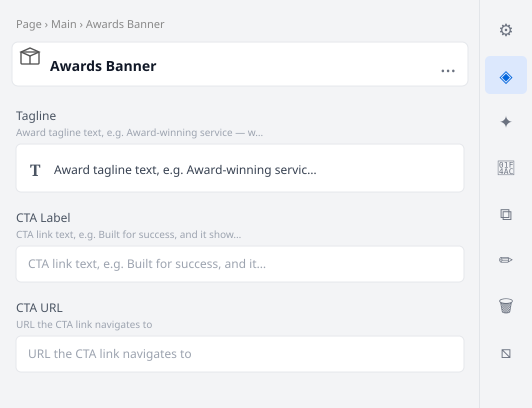

# Awards Banner

Full-width accent strip with a bold award tagline and a CTA link. Used on the homepage to
highlight NGS Super's award-winning service credentials.

## Universal Editor — Authoring View

The screenshot below shows the **properties panel** authors see in the Universal Editor when they
click to edit this block.



> To regenerate this image after model changes: `node tools/generate-ue-mockups.cjs`

---

## Authoring

| Field | Type | Description |
|---|---|---|
| Tagline | Rich Text | Award tagline text, e.g. Award-winning service — when and how you need it. |
| CTA Label | Text | CTA link text, e.g. Built for success, and it shows |
| CTA URL | Text | URL the CTA link navigates to |

## Responsive Behaviour

| Breakpoint | Behaviour |
|---|---|
| Mobile (< 900px) | Tagline and CTA stacked vertically, centred |
| Desktop (≥ 900px) | Tagline and CTA side-by-side, left-aligned, with generous horizontal padding |

## File Structure

```
blocks/awards-banner/
├── awards-banner.css
├── awards-banner.js
├── _awards-banner.json
├── README.md
├── MAPPING-README.md
└── docs/
    └── ue-authoring.svg
```
