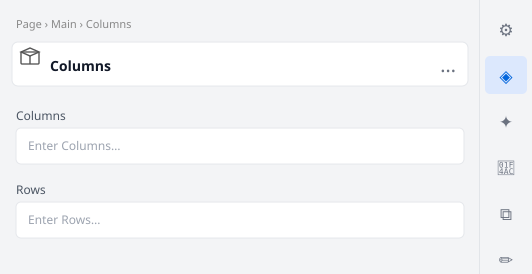

# Columns

Flexible two-column layout block. Used for side-by-side content such as image + text pairings.
Supports a CSS variant `adviser-promo` for the NGS Virtual Adviser promotional section.

## Universal Editor — Authoring View

The screenshot below shows the **properties panel** authors see in the Universal Editor when they
click to edit this block.



> To regenerate this image after model changes: `node tools/generate-ue-mockups.cjs`

---

## Authoring

### Columns block fields

| Field | Type | Description |
|---|---|---|
| Columns | Text (number) | Number of columns (e.g. 2) |
| Rows | Text (number) | Number of rows (e.g. 1) |

Each cell is authored by adding child components (`image`, `text`, `title`, `button`) inside the
column containers in the Universal Editor.

## Variants

### `adviser-promo`

Author as **`Columns (adviser-promo)`** to apply the NGS Virtual Adviser promotional styling:

- Light blue section background
- Left column: screenshot image with rounded corners and drop shadow
- Right column: heading, body text, primary CTA button, optional secondary link

## Responsive Behaviour

| Breakpoint | Behaviour |
|---|---|
| Mobile (< 900px) | Image stacks above text column; full width |
| Desktop (≥ 900px) | Two equal columns side-by-side; image column first |

## File Structure

```
blocks/columns/
├── columns.css
├── columns.js
├── _columns.json
├── README.md
├── MAPPING-README.md
└── docs/
    └── ue-authoring.svg
```
