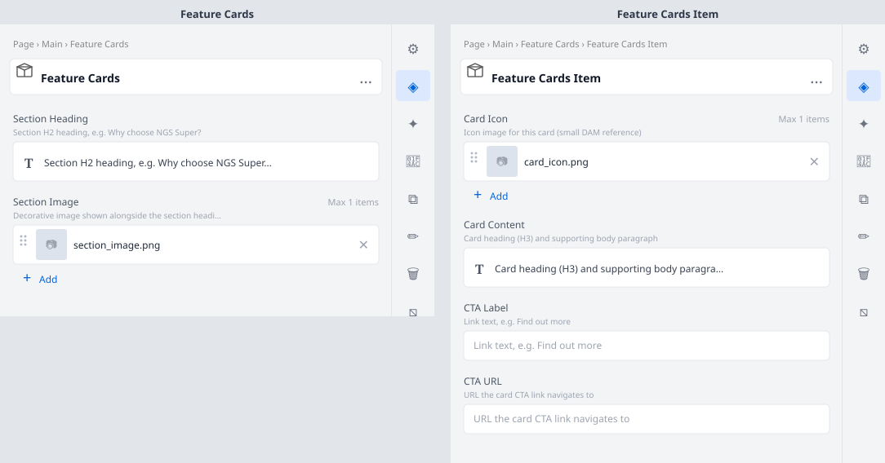

# Feature Cards

Section block displaying a heading, decorative image, and a grid of 3 feature cards — each with
an icon, heading, body text, and CTA link. Used on the homepage "Why choose NGS Super?" section.

## Universal Editor — Authoring View

The screenshot below shows the **properties panel** authors see in the Universal Editor when they
click to edit this block.



> To regenerate this image after model changes: `node tools/generate-ue-mockups.cjs`

---

## Authoring

### Feature Cards container fields

| Field | Type | Description |
|---|---|---|
| Section Heading | Rich Text | Section H2 heading, e.g. Why choose NGS Super? |
| Section Image | Reference | Decorative image shown alongside the section heading |

### Feature Cards Item child fields

Add one **Feature Cards Item** child per card (typically 3 cards per section):

| Field | Type | Description |
|---|---|---|
| Card Icon | Reference | Icon image for this card (small DAM reference) |
| Card Content | Rich Text | Card heading (H3) and supporting body paragraph |
| CTA Label | Text | Link text, e.g. Find out more |
| CTA URL | Text | URL the card CTA link navigates to |

## Responsive Behaviour

| Breakpoint | Behaviour |
|---|---|
| Mobile (< 900px) | Cards stack in a single column; section image below heading |
| Desktop (≥ 900px) | Section heading left / decorative image right; 3 cards side-by-side in equal columns |

## File Structure

```
blocks/feature-cards/
├── feature-cards.css
├── feature-cards.js
├── _feature-cards.json
├── README.md
├── MAPPING-README.md
└── docs/
    └── ue-authoring.svg
```
