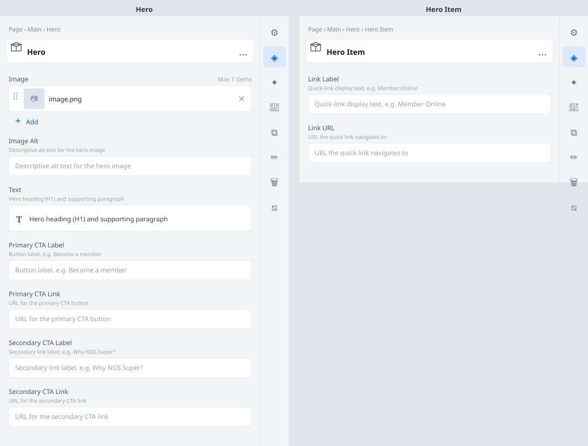

# Hero

Full-width hero banner used on the homepage, featuring a heading, supporting text, two CTA links,
a hero image, and an optional quick-links navigation bar.

## Universal Editor — Authoring View

The screenshot below shows the **properties panel** authors see in the Universal Editor when they
click to edit this block.



> To regenerate this image after model changes: `node tools/generate-ue-mockups.cjs`

---

## Authoring

### Hero block fields

| Field | Type | Description |
|---|---|---|
| Image | Reference | Hero image displayed on the right side (desktop) or top (mobile) |
| Image Alt | Text | Descriptive alt text for the hero image |
| Text | Rich Text | Hero heading (H1) and supporting paragraph |
| Primary CTA Label | Text | Button label, e.g. Become a member |
| Primary CTA Link | Text | URL for the primary CTA button |
| Secondary CTA Label | Text | Secondary link label, e.g. Why NGS Super? |
| Secondary CTA Link | Text | URL for the secondary CTA link |

### Hero Item child fields (quick-links)

Add one **Hero Item** child per quick-link. Each child has:

| Field | Type | Description |
|---|---|---|
| Link Label | Text | Quick-link display text, e.g. Member Online |
| Link URL | Text | URL the quick link navigates to |

## Responsive Behaviour

| Breakpoint | Behaviour |
|---|---|
| Mobile (< 900px) | Content stacks vertically; image below text; quick-links wrap to multiple rows |
| Desktop (≥ 900px) | Text (55%) left / Image (45%) right split; quick-links in a single horizontal row |

## File Structure

```
blocks/hero/
├── hero.css
├── hero.js
├── _hero.json
├── README.md
├── MAPPING-README.md
└── docs/
    └── ue-authoring.svg
```
