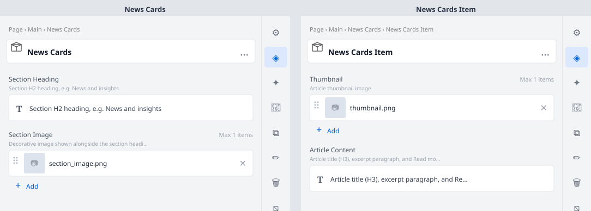

# News Cards

Section block displaying a heading, decorative image, and a grid of 3 article cards — each with
a thumbnail, article title, excerpt, and "Read more" link. Used on the homepage "News and insights"
section.

## Universal Editor — Authoring View

The screenshot below shows the **properties panel** authors see in the Universal Editor when they
click to edit this block.



> To regenerate this image after model changes: `node tools/generate-ue-mockups.cjs`

---

## Authoring

### News Cards container fields

| Field | Type | Description |
|---|---|---|
| Section Heading | Rich Text | Section H2 heading, e.g. News and insights |
| Section Image | Reference | Decorative image shown alongside the section heading |

### News Cards Item child fields

Add one **News Cards Item** child per article card:

| Field | Type | Description |
|---|---|---|
| Thumbnail | Reference | Article thumbnail image |
| Article Content | Rich Text | Article title (H3), excerpt paragraph, and Read more link |

## Responsive Behaviour

| Breakpoint | Behaviour |
|---|---|
| Mobile (< 900px) | Cards stack in a single column; section image below heading |
| Desktop (≥ 900px) | Section heading left / decorative image right; 3 cards in equal columns |

## File Structure

```
blocks/news-cards/
├── news-cards.css
├── news-cards.js
├── _news-cards.json
├── README.md
├── MAPPING-README.md
└── docs/
    └── ue-authoring.svg
```
